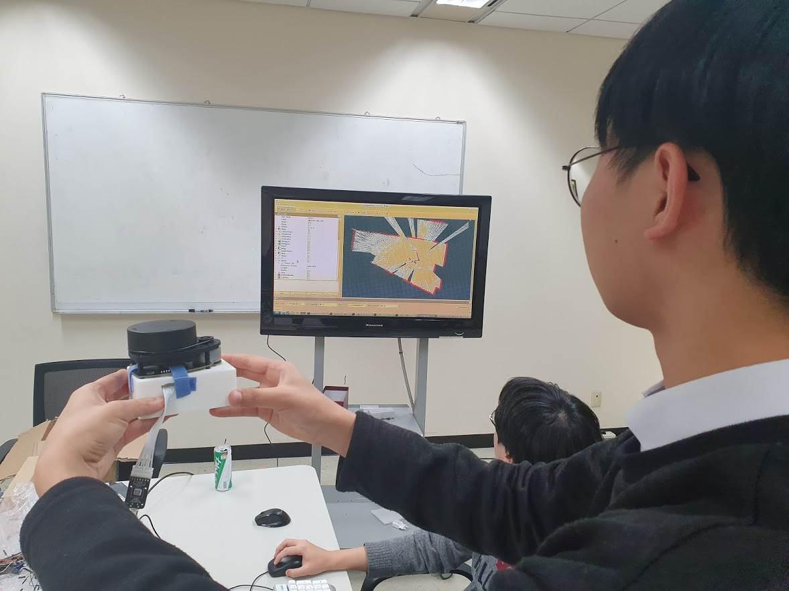
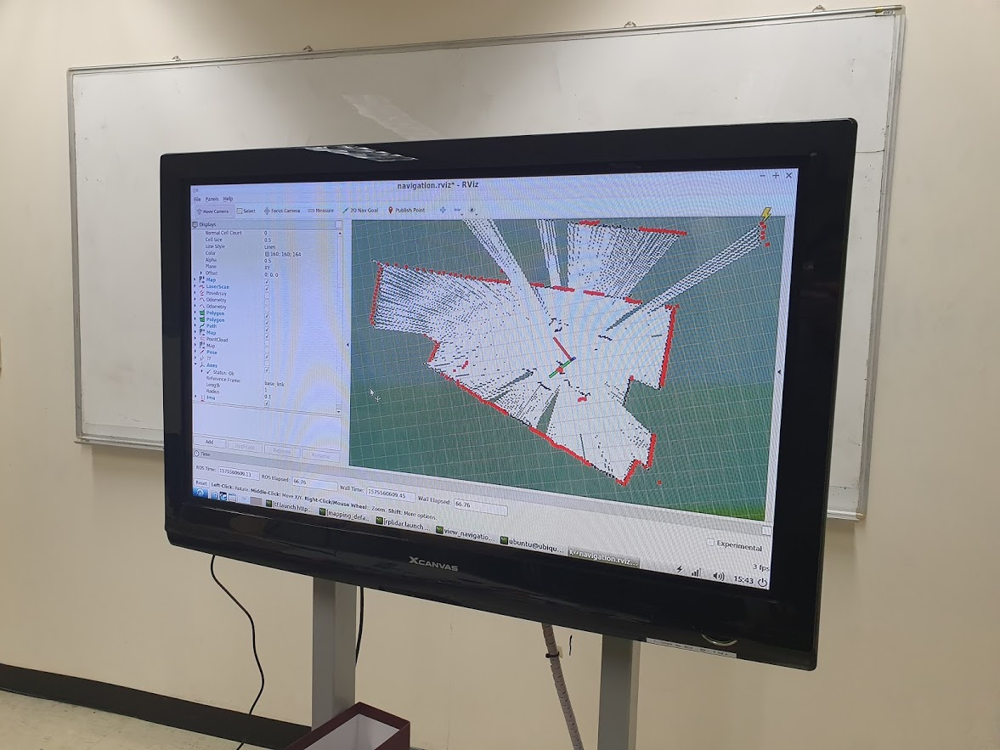
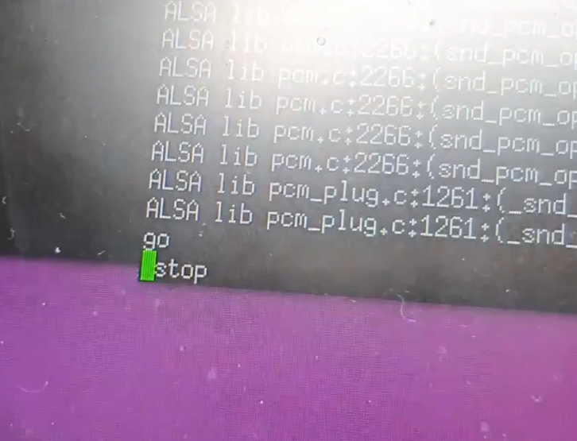
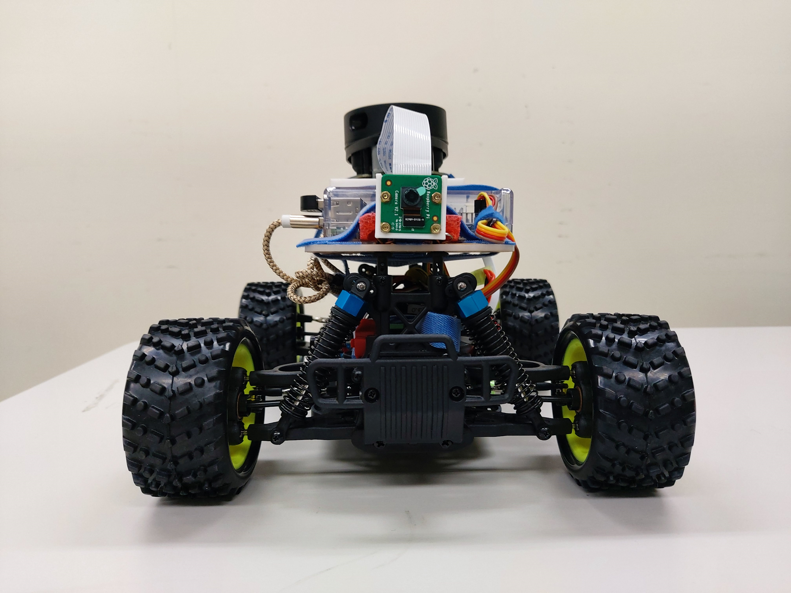

### About

1. Our project 'POSTECH RObot car REnaissance'(aka. PORORE) is about making auto-driving RC car with open sources. We combines 'Raspberry Pi 3B+' with 'Dongkey car' which is a modifiable RC car. With RPLiDAR, 2D camera, and USB microphone to implement Hector-SLAM mapping, YOLO object identification, and voice recognition driving.
2. Simply, PORORE's commands are passed on to the moving module, enabling controls such as "go," "stop," "right," "left," "fast" and "slow." It also has the ability to take pictures every five seconds while driving and recognize objects in the pictures. It can then generate a 2D map of the driven space.
    
### Feature

1. hector-SLAM mapping with RPLiDAR (POSTECH Library room #524)

    SLAM (Simultaneous localization and mapping) refers to simultaneous location tracking and mapping through moving objects. Hector-SLAM is a package of files that can be run over ROS. Our group used lidar to execute the hector slam.

    

    

2. Detect objects using a 2D camera and YOLO

    Object detection was implemented using the pictures received from the pi camera mounted on PORORE and the pre-learned yolov3_tiny_weight of Darknet.

    

3. Vehicle Manipulation with Voice Recognition

    GOOGLE SPEECH API and teleop-twist-keyboard were central to implementing vehicle control through voice recognition. Connect USB microphone to Raspberry pie, receive stt API and voice recognition file and modify it. Meanwhile, the teleop-twist-keyboard was a method of controlling the rc car by receiving keyboard input, and the code was changed to be set to the key for the word when a specific word appeared in the key setting step. At each stage, the voice recognition file was terminated and the file was run again to extend the microphone input time and reduce command confusion by words.

    

4. Assembled figure of PORORE

    

    

### References
We utilize codes from 

https://github.com/tu-darmstadt-ros-pkg/hector_slam

https://github.com/GigaFlopsis/rc_car_ros

https://github.com/ros-teleop/teleop_twist_keyboard

https://github.com/pjreddie/darknet

Since there were no modifications on source codes after we forked from other user's repositories, we did not to open the codes due to LICENSING issue. If there occur problems by not opening codes that we use, please let us know. Thank you.
